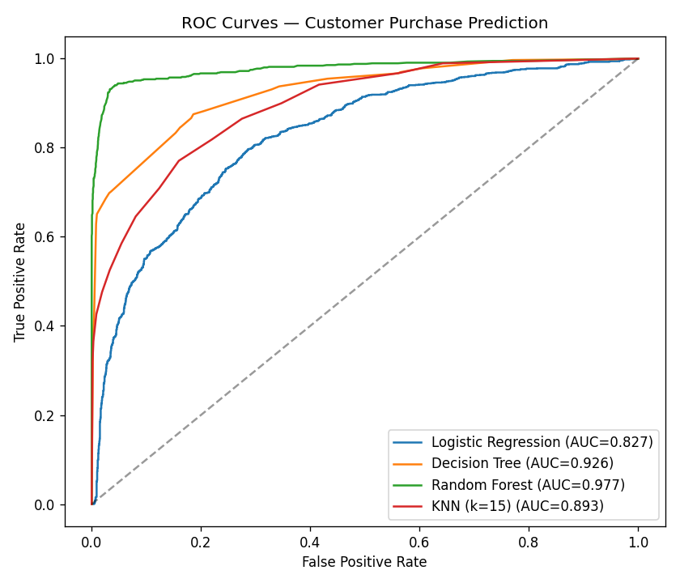
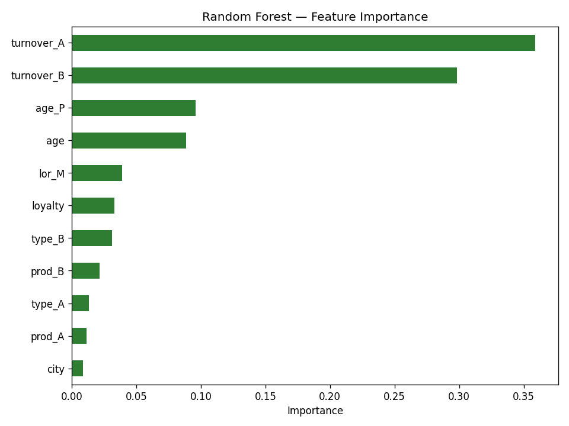

# Customer Purchase Prediction with scikit-learn 🛒

**Predict whether an existing customer will buy a newly offered product — a classic cross-sell / next-best-offer problem — using their demographics, product mix, and spending behavior.**

 

---

## 💼 Business problem
Marketing teams want to target the *right* customers for a new product so campaign spend goes where conversion is likely. This project builds a binary classifier that predicts a customer's purchase decision (`TARGET` = Y/N) from existing relationship data — directly supporting **targeted-marketing** and **cross-sell** decisions.

## 📊 Dataset
A customer-level dataset (`data/Project4_Data.csv`, bundled) with demographics and behavioral features:

| Feature | Meaning |
|---|---|
| `age`, `age_P` | customer age / age band |
| `lor_M` | length of relationship (months) |
| `type_A`, `type_B`, `prod_A`, `prod_B` | product categories / holdings |
| `turnover_A`, `turnover_B` | spend on product lines A / B |
| `loyalty`, `city` | loyalty tier, location |
| **`TARGET`** | **bought the new product? (Y/N)** — prediction target |

## 🔬 Methodology
1. **EDA** — distributions and target relationships (age and relationship length overlap between buyers/non-buyers → no single feature separates the classes, motivating a multivariate model).
2. **Preparation** — one-hot encoding of categorical fields, median imputation, feature scaling, stratified train/test split.
3. **Baseline** — the original notebook's **Logistic Regression** (interpretable coefficients).
4. **Enhancement** — a reproducible comparison of Logistic Regression, Decision Tree, **Random Forest**, and KNN with full classification metrics + ROC-AUC ([`src/model_comparison.py`](src/model_comparison.py)).

## 📈 Results

| Model | Accuracy | Precision | Recall | F1 | ROC-AUC |
|---|---|---|---|---|---|
| **Random Forest** | **0.940** | 0.918 | **0.945** | **0.932** | **0.977** |
| Decision Tree | 0.852 | 0.936 | 0.702 | 0.802 | 0.926 |
| KNN (k=15) | 0.805 | 0.812 | 0.709 | 0.757 | 0.893 |
| Logistic Regression *(baseline)* | 0.751 | 0.742 | 0.646 | 0.690 | 0.827 |

<p align="center">
  
  
</p>

**Baseline → improved:** moving from Logistic Regression to **Random Forest lifts ROC-AUC from 0.83 to 0.98** and F1 from 0.69 to 0.93 — a large, decision-relevant gain in how reliably the model flags likely buyers. Relationship length, turnover, and product type are the strongest predictors.

## ▶️ How to run
```bash
pip install -r requirements.txt
jupyter lab notebooks/customer_purchase_prediction.ipynb   # full EDA + baseline
python src/model_comparison.py                             # model comparison + figures
```

## 🗂️ Structure
```
customer-purchase-prediction/
├── data/Project4_Data.csv
├── notebooks/customer_purchase_prediction.ipynb   # EDA + logistic regression (runs end-to-end)
├── src/model_comparison.py                         # LogReg vs Tree vs RF vs KNN
├── reports/{model_comparison.md, figures/}
├── requirements.txt
└── README.md
```

## 🛠️ Tech stack
`Python` · `pandas` · `scikit-learn` · `Matplotlib` · `Seaborn`

## 🚀 Future improvements
- Probability calibration + a cost-based threshold tuned to campaign economics (cost-per-contact vs. expected margin).
- Gradient-boosted trees (XGBoost/LightGBM) and SHAP explanations for per-customer reason codes.

---
*Academic project (DAV 5400, Project 4), extended with a reproducible multi-model comparison.*
